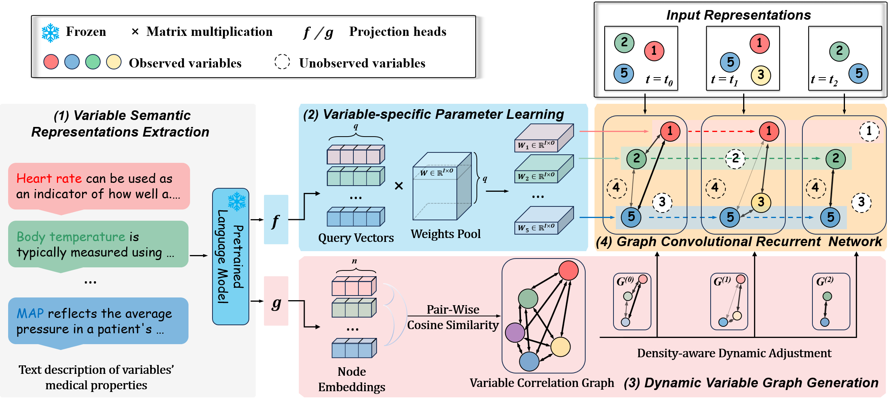

# Knowledge-Empowered Dynamic Graph Network for Irregularly Sampled Medical Time Series

## Overview

This repository contains implementation code for our NeurIPS 2024 paper: "*Knowledge-Empowered Dynamic Graph Network for Irregularly Sampled Medical Time Series*".

We propose Knowledge-Empowered Dynamic Graph Network (KEDGN), a graph neural network empowered by variables’ textual medical information, aiming to model variable-specific temporal dependencies and inter-variable dependencies in ISMTS. 
We evaluate KEDGN on four healthcare datasets.

## The model framework of KEDGN




## Experimental settings

 We conduct experiments on four widely used irregular medical time series datasets, namely P19 , Physionet, MIMIC-III  and P12  where Physionet is a reduced version of P12 considered by prior work. We compare our method with the state-of-the-art methods for modeling irregular time series,  including GRU-D , SeFT, mTAND, IP-Net , Raindrop and Warpformer. In addition, we also compared our method with two approaches initially designed for forecasting tasks, namely DGM^2  and MTGNN . The implementation and hyperparameter settings of these baselines were kept consistent with those used in Raindrop.

## Datasets

We prepared to run our code for KEDGN as well as the baseline methods with four healthcare
datasets.

### Raw data

**(1)** The PhysioNet Sepsis Early Prediction Challenge 2019  dataset consists of medical records from 38,803 patients. Each patient's record includes 34 variables. For every patient, there is a static vector indicating attributes such as age, gender, the time interval between hospital admission and ICU admission, type of ICU, and length of stay in the ICU measured in days. Additionally, each patient is assigned a binary label indicating whether sepsis occurs within the subsequent 6 hours. We follow the procedures of \cite{zhang2021graph} to ensure certain samples with excessively short or long time series are excluded. The raw data is available at https://physionet.org/content/challenge-2019/1.0.0/

**(2)** The P12  dataset comprises data from 11,988 patients after 12 inappropriate samples identified by \cite{horn2020set} were removed from the dataset. Each patient's record in the P12 dataset includes multivariate time series data collected during their initial 48-hour stay in the ICU. The time series data consists of measurements from 36 sensors (excluding weight). Additionally, each sample is associated with a static vector containing 9 elements, including age, gender, and other relevant attributes. Furthermore, each patient in the P12 dataset is assigned a binary label indicating the length of their stay in the ICU. A negative label signifies a hospitalization period of three days or shorter, while a positive label indicates a hospitalization period exceeding three days.  Raw data of **P12** can be found at https://physionet.org/content/challenge-2012/1.0.0/.

**(3)** MIMIC-III The MIMIC-III dataset is a widely used database that comprises de-identified Electronic Health Records of patients who were admitted to the ICU at Beth Israel Deaconess Medical Center from 2001 to 2012. Originally, it encompassed around 57,000 records of ICU patients, containing diverse variables such as medications, in-hospital mortality, and vital signs. Harutyunyan established a variety of benchmark tasks using a subset of this database. In our study, we focus on the binary in-hospital mortality prediction task to assess classification performance. Following preprocessing, our dataset consists of 16 features and 21,107 data points. It is available at https://physionet.org/content/mimiciii/1.4/

**(4)** Physionet contains the data from the first 48 hours of patients in ICU which is a reduced version of P12 considered by prior work. Therefore, we follow the same preprocessing methods as those used for the P12 dataset. The processed data set includes 3997 labeled instances. We focus on predicting in-hospital. It is available at https://physionet.org/content/challenge-2012/

### Processed data

For dataset P19 and P12. We use the data processed by [Raindrop](https://github.com/mims-harvard/Raindrop). 

The raw data can be found at:

**(1)** P19: https://physionet.org/content/challenge-2019/1.0.0/

**(2)** P12: https://physionet.org/content/challenge-2012/1.0.0/

The datasets processed by [Raindrop](https://github.com/mims-harvard/Raindrop) can be obtained at:

**(1)** P19 (PhysioNet Sepsis Early Prediction Challenge 2019) https://doi.org/10.6084/m9.figshare.19514338.v1

**(2)** P12 (PhysioNet Mortality Prediction Challenge 2012) https://doi.org/10.6084/m9.figshare.19514341.v1

For the MIMIC-III dataset:

1. Obtain the raw data from https://mimic.physionet.org/.
2. Execute the mortality prediction data preprocessing program from https://github.com/YerevaNN/mimic3-benchmarks to obtain the .csv files.
3. Run the data preprocessing code from https://github.com/ExpectationMax/medical_ts_datasets to obtain the .npy files.

For the PhysioNet dataset:

1. Obtain the raw data from https://physionet.org/content/challenge-2012/1.0.0/. Use only the set-a portion.

2. Execute the preprocessing file in data/physionet/process_scripts/.

   

## Requirements

KEDGN has tested using Python 3.9.

To have consistent libraries and their versions, you can install needed dependencies 
for this project running the following command:

```
pip install -r requirements.txt
```


## Running the code

After obtaining the dataset and corresponding variable representations, starting from root directory *KEDGN*, you can run models on four datasets as follows:

- Physionet

```
python train.py --dataset physionet --batch_size 256 --lr 0.001 --plm bert --plm_rep_dim 768 --query_vector_dim 5 --node_emb_dim 9 --rarity_alpha 1  --hidden_dim 8 -- source gpt 
```

- P19

```
python train.py --dataset P19 --batch_size 512 --lr 0.005 --plm bert --plm_rep_dim 768 --query_vector_dim 5 --node_emb_dim 16 --rarity_alpha 1 --hidden_dim 16 -- source gpt  
```

- P12

```
python train.py --dataset P12 --batch_size 512 --lr 0.001 --plm bert --plm_rep_dim 768 --query_vector_dim 5 --node_emb_dim 7 --rarity_alpha 3 --hidden_dim 12 -- source gpt  
```

- MIMIC-III

```
python train.py --dataset mimic3 --batch_size 256 --lr 0.005 --plm bert --plm_rep_dim 768 --query_vector_dim 7 --node_emb_dim 7 --rarity_alpha 2  --hidden_dim 12 -- source gpt 
```

Algorithms can be run with named arguments, which allow the use of different settings from the paper:

- *dataset*: Choose which dataset to use. Options: [P12, P19, physionet, mimic3].
- *batch-size*: Training batch size.
- *lr*: Training learning rate.
- *plm*: Choose the pre-trained model used for extracting variable semantic representations. Options: [bert, bart, led, gpt2, pegasus, t5].
- *plm_rep_dim*: Dimension of the output representation of the pre-trained model, corresponding to *d* in the paper. Except for Pegasus, which is 1024, others are all 768.
- *query_vector_dim*: Dimension of the query vector, corresponding to *q* in the paper.
- *node_emb_dim*: Dimension of the variable node embedding, corresponding to *n* in the paper.
- *rarity_alpha*: Proportion of the density score, corresponding to *α* in the paper.
- *hidden_dim*: Dimension of the node state/observation encoding, corresponding to *h / k* in the paper.
- *source*: Choose the textual source. Options: [gpt, name, wiki].

### Variable Semantic Representations Extraction

- Download the corresponding pre-trained language model (PLM) offline files from Hugging Face (https://huggingface.co/).

- Move the downloaded files to the respective directory under /data/plm/.

- Run the following command:

- cd ./data

  ```
   python get_var_rep.py --plm [plm_name]
  ```

  Available PLM options: [bert, bart, led, gpt2, pegasus, t5].